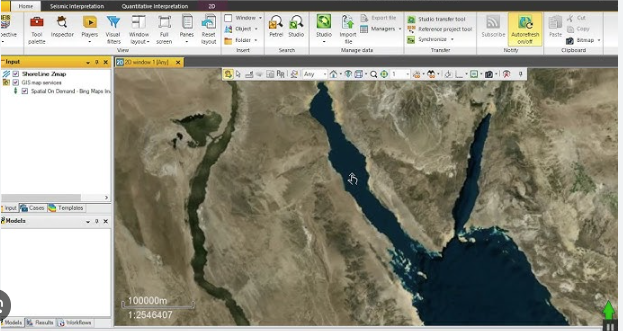
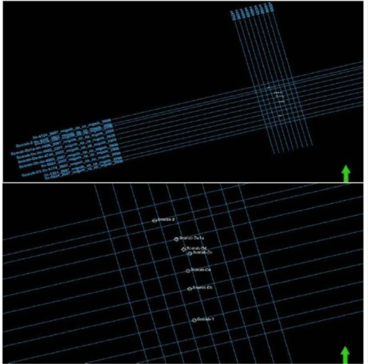
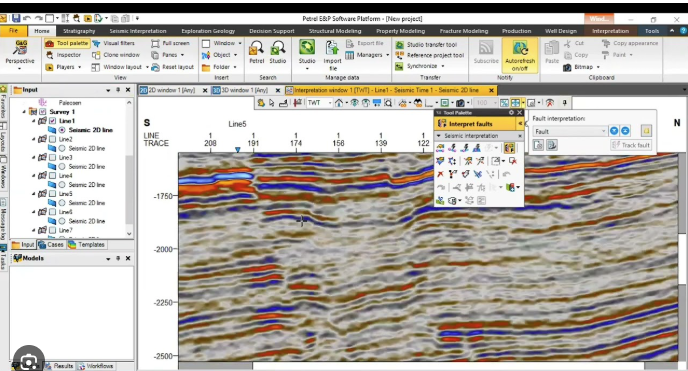
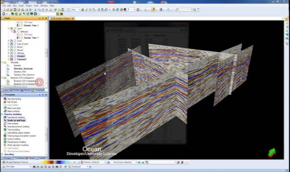
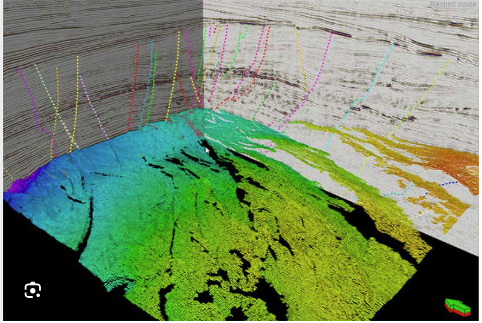

# Petrel — Exemplar

> **Why this document exists.** Petrel is referenced by the Constra project only as an exemplar — a legendary product within its own industry (oil & gas, by Schlumberger) that illustrates what an integrated, coordinate-aware geoscience workspace looks like when one is purpose-built for a domain. Constra is not a Petrel competitor and not a Petrel alternative; it is being built for a different industry (engineering and construction) that currently has no comparable workspace of its own.

## Overview

Within its own industry, Petrel integrates geophysical, geological, hydrogeological, and reservoir data into a single interactive environment. Multiple data types can be combined and visualised together to produce a unified picture of the subsurface.

Data can be displayed in both 2D (two-dimensional) and 3D (three-dimensional) views, and every view stays in sync with the others.

---

## Map View

All datasets are displayed in their true geographic location inside a shared **Map View**. Satellite imagery, seismic line locations, well locations, and cultural features (roads, buildings, infrastructure) can all be layered in the same window.

**Figure 1 — Satellite basemap in Map View.** Shows how a satellite image of the project area is loaded as the bottom layer of the map, providing real-world geographic context for everything placed on top of it.

**Figure 2 — Seismic lines overlaid with well locations.** The same Map View now also shows the geometry of acquired 2D seismic lines together with well locations. This is the kind of integrated display that lets an interpreter pick which line to open next based on where the wells are.

---

## Section View

The **Section View** is used to display data that is naturally viewed as a vertical slice through the earth — 2D seismic lines, well logs, horizons, faults, and so on.

**Figure 3 — 2D seismic line in Section View.** An individual seismic line selected from the map is shown here as a vertical section, ready for interpretation.

> **Key behaviour:** Map View and Section View are fully interactive. An action taken in one view (selecting a line, picking a horizon, moving a crosshair) is immediately reflected in the other. The same is true for every other data type loaded into the project.

---

## 3D View

In addition to 2D, all data can be viewed, interpreted, and displayed in a **3D View**, which is also synchronised with the Map View and Section View.

**Figure 4 — 3D view of seismic lines.** Multiple 2D seismic lines are rendered together in three-dimensional space, making it easier to see how the subsurface looks along intersecting acquisition directions.

**Figure 5 — 3D view of reservoir data with a well.** A reservoir model is visualised in 3D alongside a well trajectory, so the relationship between the well path and the reservoir body can be assessed directly.

---

## Coordinate System

Petrel works natively in real-world coordinates, both geographic (latitude / longitude) and projected (Easting / Northing). Every dataset is placed in its true location, and projections are handled by the software rather than by the user. This is what makes the cross-view interactivity meaningful — a well clicked in the Map View is the same well in the Section View and the 3D View, because the underlying coordinate system is unified.
